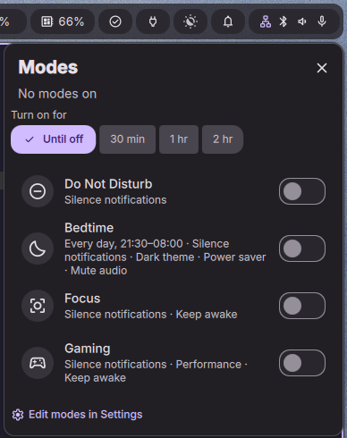

# Modes



A [DankMaterialShell](https://github.com/AvengeMedia/DankMaterialShell) plugin modelled on Android's **Modes**. A mode is a named bundle of system changes. You can turn it on by hand, for a set time, or on a schedule.

## Features

- **Default modes:** Do Not Disturb, Bedtime, Focus and Gaming. You can edit them, reorder them, delete them or add your own.
- **Effects** a mode can apply while it is on:
  - silence notifications (Do Not Disturb)
  - dark or light theme
  - turn night light on or off
  - pick a power profile
  - keep the system awake (idle inhibit)
  - mute audio, or switch the default audio output or input device
  - run a shell command when the mode turns on or off
- **Schedules:** choose the days and a start/end time. If the end time is earlier than the start, the window runs overnight. If you turn a scheduled mode off early, it stays off until that window ends, as on Android.
- **Restores your settings:** before a mode changes a setting, the plugin saves its current value. When no active mode controls that setting any more, the saved value is put back. If several modes are on at once, the one higher in the list wins on choice settings such as theme or power profile.
- **Where you control it:**
  - a bar pill showing the active mode
  - a popout to toggle modes, with "turn on for 30 min / 1 hr / 2 hr"
  - a Control Center tile with a detail list
  - IPC commands

## Install

```sh
ln -s ~/Dev/modes ~/.config/DankMaterialShell/plugins/modes
dms ipc call plugins enable modes
```

Then add the **Modes** widget to your bar or to the Control Center. To edit modes, go to Settings → Plugins → Modes.

## IPC

```sh
dms ipc call modes list               # all modes, * marks active
dms ipc call modes status
dms ipc call modes on bedtime         # by id or name
dms ipc call modes onFor focus 45     # minutes
dms ipc call modes off bedtime
dms ipc call modes toggle gaming
dms ipc call modes offAll
```

## Layout

| File | Role |
|------|------|
| `ModesDaemon.qml` | Engine: activation state, schedule checks, applying and restoring effects, IPC |
| `ModesWidget.qml` | Bar pill, popout and Control Center tile |
| `ModesSettings.qml` | Mode editor |
| `ModesLogic.js` | Pure helpers: defaults, schedule windows, effect merging |

Mode definitions are saved in DMS plugin settings. Runtime state (active modes and the saved values to restore) lives in `~/.local/state/DankMaterialShell/modes-state.json`.

During development, `dms ipc call plugins reload modes` reloads the bar widget and the daemon. DMS caches the settings page and `ModesLogic.js` until the shell restarts, so run `dms restart` after changing those.

## License

MIT © Nicolas Chartier
